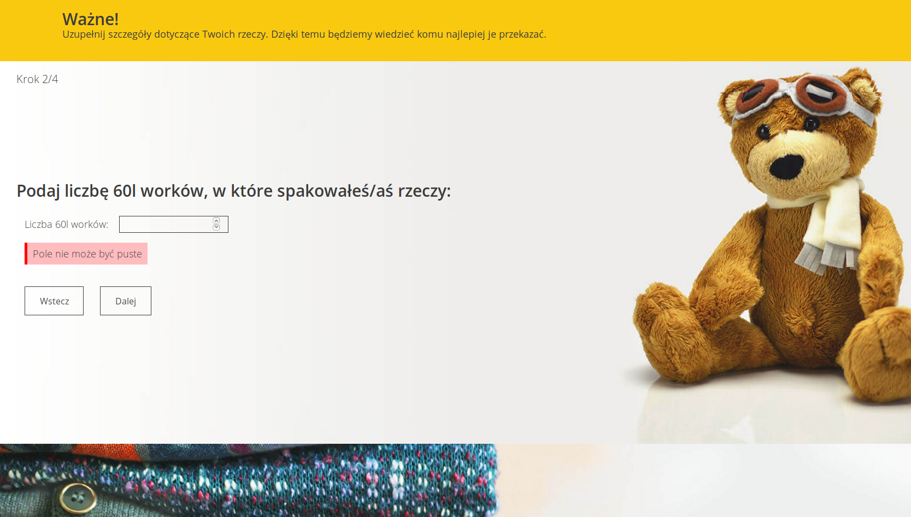
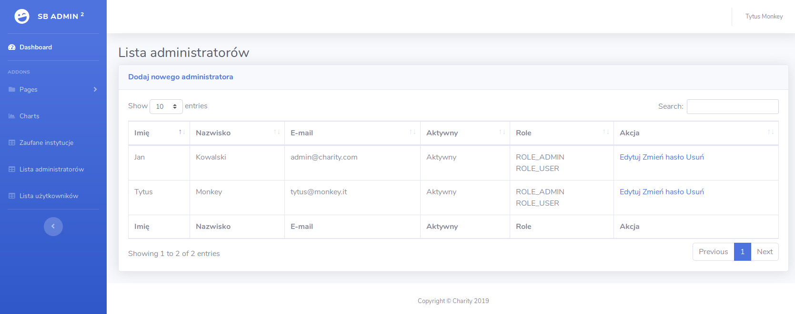

## Charity App | Help charities by giving up your stuff

Used technologies: Spring Boot, Spring Form, Spring Data, Spring Security, Hibernate, JSP + JSTL.

Project purpose: to ease and simplify the process of giving up your stuff to charities.

#### Main features: 
- ##### for users:
    - user account creation (register and login, validation)
    - donation form
    - managing user donation 
    - archiving user donation
    - changing profile details
    - changing password
    

- ##### for admins:
    - managing trusted charities
    - managing admins (edit, change roles, activate / deactivate, deletion)
    - managing users (edit, change roles, activate / deactivate, deletion)

##### Future features / things TO-DO
- code refactor (clean up, transfer of logic from controllers to services)
- email sending
- account activation by email
- password reset by email

